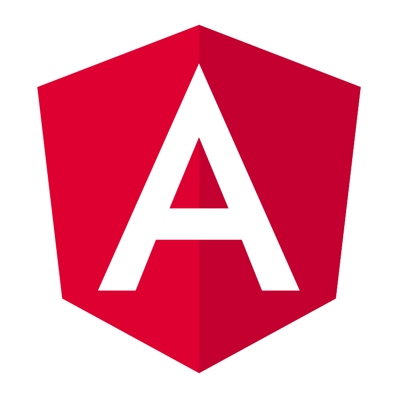

<h1 align="center">Hi 👋, I'm Daniel</h1>
<h3 align="center">A passionate Full Stack Developer from Spain</h3>

- 👨‍💻 All of my projects are available at [https://github.com/danielfpc11](https://github.com/danielfpc11)

- 📫 How to reach me? **danielfpc11@gmail.com** or **+34 640 361 003**

- 💬 Ask me about **Java**, **Spring**, **Spring Boot**, **SAP Hybris**, **TypeScript**, **Angular** and **SAP Spartacus**.

- 📄 Know about my experiences in [https://www.linkedin.com/in/daniel-pulgarin](https://www.linkedin.com/in/daniel-pulgarin)

- 🌐 Check out my web page [https://www.pulga.xyz](https://www.pulga.xyz)

<h3 align="left">Connect with me:</h3>

    
    

<h3 align="left">Technologies That I Know</h3>
<h4 align="left">Back-End Development:</h4>

    
    
    
    

<h4 align="left">Front-End Development:</h4>

     
    
    
    
    
    

<h4 align="left">Testing:</h4>

    
    
    
    
    

<h4 align="left">Software and Tools:</h4>

     
     
     
     
    
    
    
     
    
    

